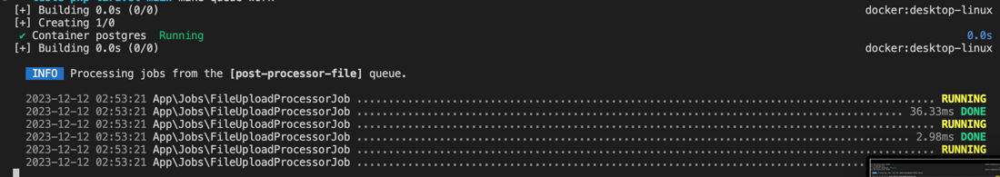
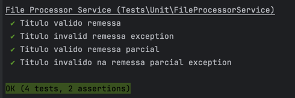

# Teste Laravel - Aplicação Upload de Arquivo

### Stack utilizada
- PHP 8.1
- Laravel 10
- PHPUNIT
- PostgreSQL
- Docker + Docker Compose

## Rodando projeto local

Para iniciar o projeto, execute o seguinte comando:

```
make start
```

## URL do projeto

O projeto estará sendo executado no endereço http://localhost:6539/upload

## Processamento da fila

Para iniciar o processamento dos arquivos submetidos, basta executar o seguinte comando:

```
make queue-work 
```
Caso existam arquivos pendentes de processamento, o resultado será semalhante a este:


## Testes unitários

Para validar os testes unitários, execute
```
make unit-tests
```


## Comandos úteis

### Realizar build da imagem docker
```make build``` 
### Atualizar os pacotes do composer
`make update`:

### Executa as migrations
`make db-migrate`

### Rodar as Seeds
`make db-seed`


## Melhorias Migrations
- Inclusão de indices nas principais colunas, otimizando a pesquisa em ambas tabelas
- Adição do campo de `status` na coluna `documents`, facilitando a visualização dos arquivos já processados dos pendentes.
